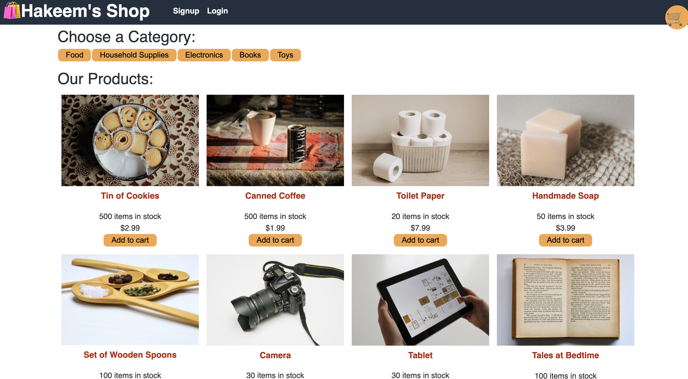
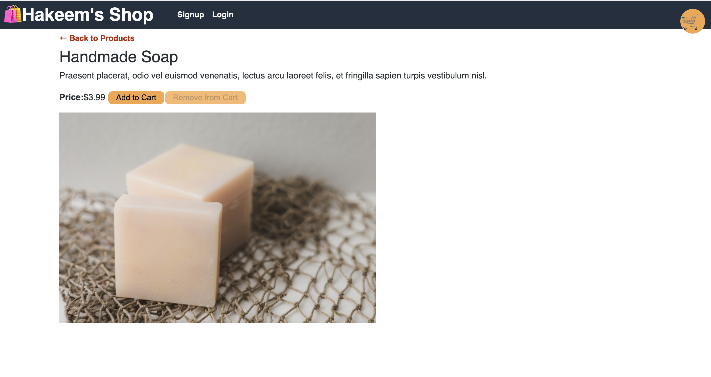
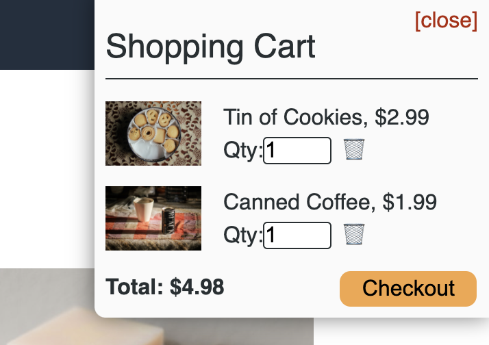
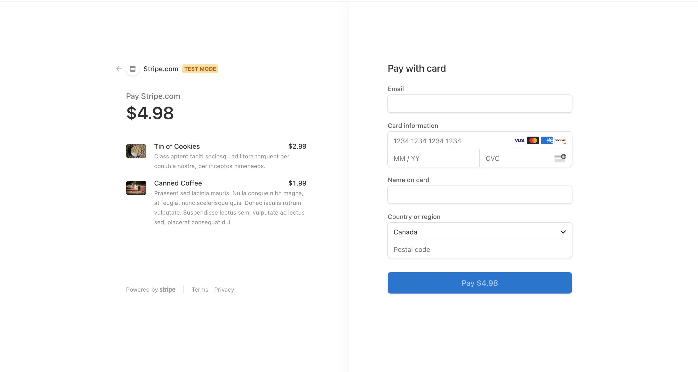

# redux-store

## Table of contents
 * [General info](#General-Info)
 * [Specifics](#Specifics)
 * [Deployment of application](#Deployment-of-application)
 * [Application Code](#Application-Code)
 * [Screenshots](#Screenshots)
 * [Future Developments](#Future-Developments)

 # General Info

 

 # Specifics

 # Deployment of application

 

   [Deployment](https://hakeemshope.herokuapp.com/)

 # Application Code

  

   [GitHub](https://github.com/hakeem235/Hakeems_Shops)

 # Screenshots

 #### Home page

   

#### Single Produtc view

#### Chart view

#### Payment view

